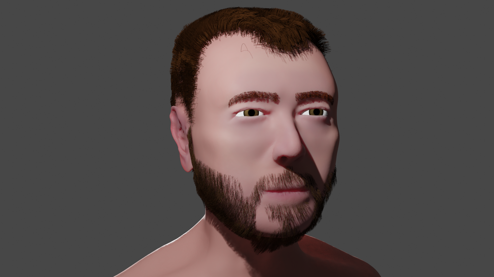

## Human head

This repository is the result of the Udemy course [Complete Blender Creator: Learn 3D Modelling for Beginners](https://www.udemy.com/course/blendertutorial/), the furry heads segments.
I followed the tutorial, but I *tried* to make my own head, instead of the instructors'.

I didn't really get the resemblance that I was looking for , but I'm pleased with the result nonetheless.
Here are some renders in Cycles:

